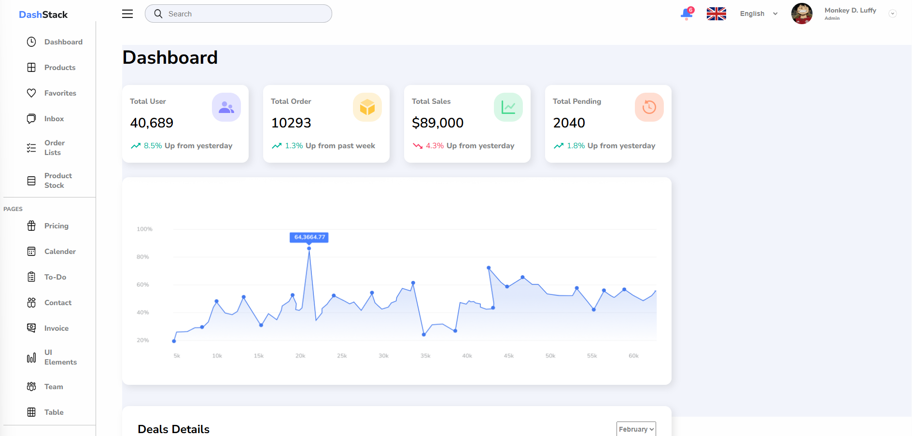

# Dashboard - activity

## Table of contents

- [Overview](#overview)
  - [The challenge](#the-challenge)
  - [Screenshot](#screenshot)
  - [Links](#links)
- [My process](#my-process)
  - [Built with](#built-with)
  - [What I learned](#what-i-learned)
  - [Continued development](#continued-development)
  - [Useful resources](#useful-resources)
- [Author](#author)
- [Acknowledgments](#acknowledgments)

### The challenge

Users should be able to:

- See hover and focus states for all interactive elements on the page

### Screenshot

### Links

- Solution URL: (https://github.com/AntonielAureliano/01-dashboard)
- Live Site URL: (https://01-dashboard-psi.vercel.app/)

## My process

### Built with

- Semantic HTML5 markup
- CSS custom properties
- Flexbox
- CSS Grid

## Author

- Linkedin - [Antoniel Aureliano](https://www.linkedin.com/in/antoniel-aureliano)
- Frontend Mentor - [@Antoniel Aureliano](https://www.frontendmentor.io/profile/AntonielAureliano)
- Twitter - [@AntonielAureli](https://twitter.com/AntonielAureli)
